# MediRoute — Use Case Documentation

## Actors

| Actor | Description |
|---|---|
| **Patient / Citizen** | Person in an emergency needing urgent medical response |
| **Paramedic / EMT** | Field paramedic operating the emergency ambulance |
| **Hospital Staff** | ER nurse / trauma physician managing ER bed intake |
| **Admin / Dispatcher** | City emergency coordinator monitoring fleet telemetry |
| **AI Triage Agent** | Automated LLM engine scoring ESI acuity and specialties |
| **Dispatch Engine** | Automated geospatial ambulance assignment service |
| **MILP Allocator** | Mixed Integer Linear Programming hospital optimization algorithm |
| **OSRM Router** | Real-time road routing and green-corridor ETA service |
| **Twilio WhatsApp** | Messaging intake and bidirectional emergency updates |
| **Twilio Voice** | Interactive voice response and emergency intake call handler |
| **Groq Whisper** | Speech-to-text audio intake transcription service |
| **EmailJS Gateway** | Emergency notification alert service to ER trauma desks |
| **Mapbox GL 3D** | High-precision vector GIS and 3D urban rendering service |

---

## Use Case Diagram

```mermaid
graph TB
    subgraph Actors
        P[👤 Citizen / Patient]
        PR[🚑 Paramedic]
        H[🏥 Hospital Staff]
        A[🔧 City Dispatcher / Admin]
        TW[📱 Twilio WhatsApp]
        TV[📞 Twilio Voice]
        EM[📧 EmailJS Gateway]
    end

    subgraph UC_Patient[Patient Use Cases]
        UC1[UC-01: Register / Login]
        UC2[UC-02: Trigger SOS Intake]
        UC3[UC-03: Voice Triage via Mic]
        UC4[UC-04: Track Ambulance Live]
        UC5[UC-05: View Incident History]
        UC6[UC-06: Manage Emergency Medical Profile]
    end

    subgraph UC_Paramedic[Paramedic Use Cases]
        UC7[UC-07: Receive Dispatch Alert]
        UC8[UC-08: Navigate to Patient]
        UC9[UC-09: Enter Patient Vitals HUD]
        UC10[UC-10: Update Incident Status]
        UC11[UC-11: Navigate to Hospital]
    end

    subgraph UC_Hospital[Hospital Use Cases]
        UC12[UC-12: View Incoming Patients]
        UC13[UC-13: Pre-Accept & Bed Reservation]
        UC14[UC-14: Manage Bed & ICU Resources]
        UC15[UC-15: Toggle Hospital Diversion]
        UC16[UC-16: View Live Ambulance Radar]
    end

    subgraph UC_Admin[Admin & Dispatch Use Cases]
        UC17[UC-17: View System Analytics Dashboard]
        UC18[UC-18: 3D GIS Multi-Angle Command Map]
        UC19[UC-19: View Surge Forecast Engine]
        UC20[UC-20: Fleet & Incident Dispatch Control]
        UC21[UC-21: Seed Demo Data]
    end

    subgraph UC_Comms[Emergency Comms & Alerts]
        UC22[UC-22: SOS via WhatsApp Bot]
        UC23[UC-23: Emergency Voice Call Intake]
        UC24[UC-24: EmailJS Real-time ER Dispatch Alert]
    end

    P --> UC1
    P --> UC2
    P --> UC3
    P --> UC4
    P --> UC5
    P --> UC6

    PR --> UC7
    PR --> UC8
    PR --> UC9
    PR --> UC10
    PR --> UC11

    H --> UC12
    H --> UC13
    H --> UC14
    H --> UC15
    H --> UC16

    A --> UC17
    A --> UC18
    A --> UC19
    A --> UC20
    A --> UC21

    TW --> UC22
    TV --> UC23
    EM --> UC24

    UC2 -.->|triggers| UC3
    UC7 -.->|extends| UC9
    UC10 -.->|extends| UC11
    UC2 -.->|notifies| UC24
```



---

## Detailed Use Case Descriptions

---

### UC-01: Register / Login
| Field | Detail |
|---|---|
| **Actor** | Patient, Paramedic, Hospital Staff, Admin |
| **Precondition** | User has valid credentials or clicks 1-Click Demo Evaluation access |
| **Trigger** | User opens the MediRoute platform login |
| **Main Flow** | 1. User selects role (Patient/Paramedic/Hospital/Admin) → 2. Enters email + password (or clicks 1-Click Demo Login) → 3. System validates credentials or auto-provisions demo account → 4. JWT token issued → 5. Redirected to role-specific portal |
| **Alternate Flow** | New user selects "Register" → fills name, email, password, role → account created |
| **Postcondition** | User is authenticated with a 7-day JWT token |

---

### UC-02: Trigger SOS Intake
| Field | Detail |
|---|---|
| **Actor** | Citizen / Patient |
| **Precondition** | Patient is logged in or triggers 1-Click SOS; location permission granted |
| **Trigger** | Patient presses the prominent SOS button |
| **Main Flow** | 1. Browser/device captures GPS coordinates → 2. Incident created in MongoDB Atlas → 3. AI clinical triage triggered asynchronously → 4. Dispatchers notified via Socket.io → 5. Nearest ambulance identified by geospatial query → 6. Paramedic dispatched → 7. Patient sees live tracking HUD |
| **Alternate Flow** | Location unavailable → patient types address → geocoded to coordinates |
| **Postcondition** | Incident record created; ambulance dispatched; hospital allocation begins |

---

### UC-03: Voice Triage via Microphone
| Field | Detail |
|---|---|
| **Actor** | Patient, AI Triage Agent |
| **Precondition** | Patient has triggered SOS; microphone permission granted |
| **Trigger** | Patient taps the voice triage button |
| **Main Flow** | 1. Browser records audio (Web Speech API or MediaRecorder) → 2. Audio transcribed by Groq Whisper → 3. Transcript sent to Groq LLM → 4. ESI 1–5 score computed → 5. Required medical specialties identified → 6. Incident updated with triage data → 7. MILP allocator triggered |
| **Alternate Flow** | Speech API unavailable → patient types complaint manually |
| **Postcondition** | Incident has ESI level, AI summary, confidence score, specialty requirements |

---

### UC-04: Track Ambulance Live
| Field | Detail |
|---|---|
| **Actor** | Patient |
| **Precondition** | Active incident with assigned ambulance |
| **Trigger** | Patient views the tracking map |
| **Main Flow** | 1. Patient connects to Socket.io → 2. Paramedic's GPS pings every 2s via `gps_update` → 3. Server broadcasts `ambulance_location` → 4. Mapbox marker animates to new position → 5. ETA updates from route data |
| **Postcondition** | Patient sees live ambulance position with ETA countdown |

---

### UC-07: Receive Dispatch Alert
| Field | Detail |
|---|---|
| **Actor** | Paramedic, Dispatch Engine |
| **Precondition** | Paramedic is on-duty and ambulance status is AVAILABLE |
| **Trigger** | AI triage completes; nearest ambulance identified by geospatial query |
| **Main Flow** | 1. System executes `$nearSphere` query on ambulances → 2. Nearest AVAILABLE ambulance found → 3. `dispatch_alert` emitted to paramedic's socket room → 4. Toast notification + incident details shown → 5. Paramedic taps to accept → 6. Ambulance status transitions to DISPATCHED |
| **Postcondition** | Ambulance status = DISPATCHED; incident has `assignedAmbulance` |

---

### UC-08: Navigate to Patient
| Field | Detail |
|---|---|
| **Actor** | Paramedic, OSRM Router |
| **Precondition** | Dispatch accepted; patient location known |
| **Trigger** | Paramedic views Navigation tab |
| **Main Flow** | 1. OSRM API called with ambulance origin → patient destination → 2. Route GeoJSON returned → 3. Mapbox renders illuminated route line → 4. Turn-by-turn steps displayed → 5. GPS updates move ambulance marker → 6. ETA countdown updates in real time |
| **Postcondition** | Paramedic navigating; route visible on tactical map |

---

### UC-09: Enter Patient Vitals
| Field | Detail |
|---|---|
| **Actor** | Paramedic |
| **Precondition** | Paramedic is at patient location; active incident |
| **Trigger** | Paramedic opens Vitals panel |
| **Main Flow** | 1. Paramedic enters Heart Rate, SpO₂, Respiration, Blood Pressure, GCS, Temperature → 2. "Transmit Vitals" pressed → 3. Socket.io `vitals_update` event fired → 4. Hospital ER receives live vitals → 5. Patient card updates in real-time → 6. Vitals saved to incident in MongoDB |
| **Postcondition** | Hospital has live patient vitals before arrival |

---

### UC-12: View Incoming Patients
| Field | Detail |
|---|---|
| **Actor** | Hospital Staff |
| **Precondition** | Hospital staff logged in; hospital linked to their account |
| **Trigger** | Hospital staff opens ER Command Center |
| **Main Flow** | 1. Existing active incidents fetched via API → 2. Socket.io listens for `new_incident`, `vitals_update`, `incident_status` → 3. Patient cards displayed with ESI color badge → 4. AI summary + allergies + ETA shown → 5. Cards update in real-time as vitals stream |
| **Postcondition** | Hospital has full pre-arrival patient situational awareness |

---

### UC-13: Pre-Accept & Bed Reservation
| Field | Detail |
|---|---|
| **Actor** | Hospital Staff |
| **Precondition** | Incoming patient card visible; beds available |
| **Trigger** | Staff clicks "Pre-Accept" on incoming patient card |
| **Main Flow** | 1. `PATCH /api/incidents/:id/status` with `ARRIVED_AT_HOSPITAL` → 2. Incident updated → 3. Socket.io broadcasts status change → 4. Patient + admin notified → 5. Bed reservation recorded |
| **Postcondition** | Bed assigned; trauma team alerted; zero-wait ER handover |

---

### UC-18: 3D GIS Multi-Angle Command Map
| Field | Detail |
|---|---|
| **Actor** | City Dispatcher / Admin |
| **Precondition** | Admin logged into City Operations portal |
| **Trigger** | Admin selects "City Map" tab |
| **Main Flow** | 1. Mapbox GL 3D vector engine renders Mumbai metropolitan grid → 2. User toggles camera angles (3D Isometric 55°, Horizon 75°, Tactical 2D 0°, 360° Orbit) → 3. Live ambulance GPS vectors animate → 4. Hospital pins show real-time ICU bed availability → 5. Clicking any entity flies camera to location |
| **Postcondition** | Complete visual digital-twin command across metropolitan emergency grid |

---

### UC-22: SOS via WhatsApp (Twilio)
| Field | Detail |
|---|---|
| **Actor** | Citizen (via Twilio WhatsApp) |
| **Precondition** | Citizen has WhatsApp; Twilio webhook configured |
| **Trigger** | Citizen sends "SOS" to Twilio WhatsApp number |
| **Main Flow** | 1. Twilio receives message → webhook fires `POST /api/twilio/whatsapp` → 2. Message parsed → "SOS" keyword detected → 3. System prompts for location pin → 4. Citizen sends location → 5. Incident created → 6. Ambulance dispatched → 7. Bot replies with live ETA and hospital destination |
| **Postcondition** | Incident created; citizen receives live WhatsApp status |

---

### UC-24: EmailJS Real-time ER Dispatch Alert
| Field | Detail |
|---|---|
| **Actor** | EmailJS Alert Gateway, ER Trauma Desk |
| **Precondition** | Critical incident created (ESI-1 or ESI-2) |
| **Trigger** | New critical emergency logged in system |
| **Main Flow** | 1. Incident triage completes with high acuity → 2. Client/Server invokes `sendEmergencyAlert()` → 3. EmailJS dispatches templated notification to ER Chief and emergency contacts → 4. Email contains incident number, chief complaint, ESI level, and assigned unit |
| **Postcondition** | Immediate email dispatch alert logged and delivered |

---

## Key System Sequence Interaction

```
Patient         System Gateway        AI Engine        Paramedic        Hospital ER
   │                  │                  │                 │                 │
   │───SOS Intake────▶│                  │                 │                 │
   │                  │──Create Incident──────────────────▶│                 │
   │                  │──Trigger Triage─▶│                 │                 │
   │                  │◀─ESI Severity────│                 │                 │
   │                  │──Find Ambulance───────────────────▶│                 │
   │                  │──dispatch_alert───────────────────▶│                 │
   │◀──Status Update──│                  │                 │──Accept────────▶│
   │                  │──MILP Allocate──▶│                 │                 │
   │                  │◀─Hospital Rank───│                 │                 │
   │                  │──Pre-alert ER (Socket + EmailJS)────────────────────▶│
   │                  │                  │    │──GPS Ping─▶│                 │
   │                  │                  │    │◀─Broadcast─│                 │
   │◀─Ambulance Loc───│                  │    │            │                 │
   │                  │                  │    │──Vitals─────────────────────▶│
   │                  │──Pre-Accept & Bed Reserved──────────────────────────▶│
   │◀──Bed Reserved───│                  │                 │                 │
```
